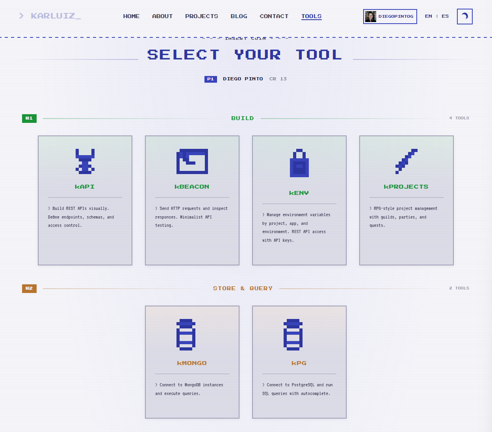

# diegops

[](https://github.com/CaDi-Team/diegops-tools/actions/workflows/ci.yml)
[](LICENSE)

Personal productivity CLI for humans and containers — workspace management, secret injection, cloud config sync, managed DevOps toolbox, and developer workstation setup in a single static binary.

## What is diegops?

`diegops` solves a simple problem: **setting up and keeping multiple workstations in sync**. Whether you're jumping between a laptop, a desktop, a WSL environment, or a fresh container, you want the same repos cloned, the same SSH keys in place, the same `.env` files injected, and the same tools available — without manual copy-paste.

It does this by treating **GitHub as the source of truth for configuration** and **HashiCorp Vault as the source of truth for secrets**:

- **GitHub** stores your non-sensitive config files (repo lists, tool preferences, workspace layouts) in a private repo that `diegops sync` manages automatically. It also provides the API token that powers tool downloads and authenticated operations.
- **Vault** stores your sensitive files (SSH keys, kubeconfigs, `.env` secrets) as base64-encoded KV entries. `diegops secrets` and `diegops vault` read and write these entries so your secrets travel with you securely — never in git, never in plaintext on disk longer than needed.

On top of that, `diegops` bundles a **managed toolbox** (`diegops tool`) that downloads and updates common DevOps CLIs (gh, vault, terraform, helm, kubectl, jq, yq, k9s, trivy, trippy) so you don't need `brew`, `apt`, or manual downloads.

`diegops` also integrates **[ktool cli](https://github.com/CaDi-Team/karluiz-tool-cli)** — a growing suite of free developer tools built by [Karluiz](https://karluiz.com/). Today `diegops ktool` manages the ktool binary and proxies commands like `kenv` for secret management. As ktool expands its capabilities, `diegops` will grow with it — ktool integration is a core part of the roadmap.

The end result: run `diegops bootstrap` on a fresh machine and walk away with a fully configured workstation.

---

### Prerequisites

`diegops` currently depends on two external CLIs for most of its functionality:

| Dependency | Used by | Install |
|------------|---------|---------|
| **[GitHub CLI (`gh`)](https://cli.github.com/)** | `auth`, `sync`, `bootstrap` | `diegops tool install gh` |
| **[HashiCorp Vault (`vault`)](https://developer.hashicorp.com/vault)** | `vault`, `secrets`, `bootstrap` | `diegops tool install vault` |

Both must be installed and authenticated before using the commands listed above. You can install them with `diegops tool install` or bring your own. More backend options are planned for the future, but **as of today these are hard requirements**.

```sh
diegops tool install gh         # install GitHub CLI
diegops tool install vault      # install Vault CLI
diegops auth gh login <PAT>     # authenticate with GitHub
vault login                     # authenticate with Vault
diegops bootstrap               # you're ready
```

---

## Supported Platforms

| OS | Architecture | Target |
|----|-------------|--------|
| macOS | Apple Silicon | `aarch64-apple-darwin` |
| macOS | Intel | `x86_64-apple-darwin` |
| Ubuntu / Debian | x86_64 | `x86_64-unknown-linux-gnu` |
| Alpine (containers) | x86_64 | `x86_64-unknown-linux-musl` |
| Alpine (containers) | ARM64 | `aarch64-unknown-linux-musl` |
| Windows (WSL / native) | x86_64 | `x86_64-pc-windows-gnu` |

---

## Installation

Download the binary for your platform from the [latest release](../../releases/latest) and put it somewhere on your `PATH`.

### Linux / macOS (one-liner)

```sh
VERSION=$(curl -fsSL https://api.github.com/repos/CaDi-Team/diegops-tools/releases/latest | grep '"tag_name"' | cut -d'"' -f4)
TARGET=aarch64-apple-darwin   # see platform table above

curl -fsSL "https://github.com/CaDi-Team/diegops-tools/releases/download/${VERSION}/diegops-${VERSION}-${TARGET}.tar.gz" \
  | tar -xz
sudo mv diegops /usr/local/bin/diegops
```

### Alpine / containers (musl static)

```sh
VERSION=$(curl -fsSL https://api.github.com/repos/CaDi-Team/diegops-tools/releases/latest | grep '"tag_name"' | cut -d'"' -f4)
curl -fsSL "https://github.com/CaDi-Team/diegops-tools/releases/download/${VERSION}/diegops-${VERSION}-x86_64-unknown-linux-musl.tar.gz" \
  | tar -xz -C /usr/local/bin
```

### Windows (PowerShell)

```powershell
$repo    = "CaDi-Team/diegops-tools"
$version = (Invoke-RestMethod "https://api.github.com/repos/$repo/releases/latest").tag_name
$url     = "https://github.com/$repo/releases/download/$version/diegops-$version-x86_64-pc-windows-gnu.zip"
Invoke-WebRequest -Uri $url -OutFile diegops.zip
Expand-Archive -Path diegops.zip -DestinationPath "$env:USERPROFILE\bin" -Force
```

### Updating

```sh
diegops update
```

Fetches the latest release, downloads the binary for your platform, and replaces itself in place. Idempotent — prints "Already up to date" if current.

> **Permissions:** if the binary lives in `/usr/local/bin`, you may need `sudo diegops update`. The CLI will tell you.

---

## Commands at a Glance

```
diegops version              Print version
diegops update               Self-update to latest release
diegops cadi                 Show the DiegOps hero screen
diegops help                 Show help
diegops bootstrap            Full workstation setup in one shot

diegops repo ...             Manage git repository workspace
diegops vault ...            Pull Vault secrets into .env files
diegops secrets ...          Sync workstation files via Vault
diegops auth ...             Manage authentication tokens
diegops devtools ...         Developer workstation setup (git, gpg, ssh)
diegops sync ...             Cloud-sync config files to GitHub
diegops tool ...             Manage DevOps CLI tools
diegops ktool ...            Manage and run ktool (karluiz tools)

diegops <tool> <args>        Run a managed tool (gh, vault, terraform, etc.)
```

---

## `diegops bootstrap` — Full Workstation Setup

Set up a fresh workstation with a single command. Verifies authentication, pulls cloud config, clones repositories, injects secrets, and restores workstation files.

```
diegops bootstrap
```

**What it does (in order):**

1. Checks GitHub CLI is authenticated
2. Checks Vault CLI is authenticated
3. Pulls config files from cloud (`sync pull`)
4. Clones all configured repositories (`repo apply`)
5. Injects `.env` secrets from Vault (`vault apply`)
6. Restores workstation files from Vault (`secrets pull`)

Finishes with the hero banner and a per-step summary. If any execution step fails, it continues with the remaining steps and reports all failures at the end.

**Requires:** GitHub token (`diegops auth gh login` first) and Vault session (`vault login` first).

---

## `diegops repo` — Workspace Management

Clone and manage a set of git repositories defined in a YAML config file.

```
diegops repo init                          Create sample config at ~/.diegops/repos.yaml
diegops repo apply [--path P] [--config F] Clone all missing repos (idempotent)
diegops repo list [--config F]             Show repos already cloned locally
diegops repo list-diff [--config F]        Show repos in config but not yet cloned
```

**Config** (`~/.diegops/repos.yaml`):

```yaml
targets:
  - path: $HOME/github/my-org/products
    repos:
      - git@github.com:my-org/web-front.git
      - git@github.com:my-org/api-service.git
```

```sh
diegops repo init          # create sample config
diegops repo apply         # clone everything
diegops repo list-diff     # see what's missing
```

> Override config path with `--config <path>` or `$DIEGOPS_REPOS_CONFIG`.

---

## `diegops vault` — Secret Management

Pull secrets from HashiCorp Vault KV v2 and write `.env` files.

```
diegops vault init                          Create sample config at ~/.diegops/repo-vault.yaml
diegops vault apply [--path P] [--config F] Pull secrets and write .env files (idempotent)
diegops vault list [--config F]             Show targets with .env files
diegops vault list-diff [--config F]        Show targets missing .env files
```

**Config** (`~/.diegops/repo-vault.yaml`):

```yaml
targets:
  - path: $HOME/github/my-org/my-app
    secrets:
      - vault_path: secret/my-app/database
        keys: [username, password]
      - vault_path: secret/my-app/api
        keys: "*"
```

**Requires:** `vault` CLI on PATH, `VAULT_ADDR` set, authenticated session.

> `.env` files use `KEY="value"` format. `.gitignore` is auto-updated. Content-aware skip avoids unnecessary writes.

---

## `diegops auth` — Credential Management

Manage authentication tokens for external services.

```
diegops auth gh login <PAT>     Validate and store a GitHub token
diegops auth gh logout          Remove stored GitHub token
diegops auth gh whoami          Show authenticated GitHub user and scopes
diegops auth status             Show status for all providers (GitHub + ktool kenv)
diegops auth logout             Remove all stored tokens
```

**Storage:** `~/.diegops/tokens/gh.json` (0600 permissions on Unix).

**Resolution order:** stored file > `$GITHUB_TOKEN` env var > unauthenticated.

> `auth status` also shows ktool's kenv token status (read-only from `~/.ktool/tokens/`).

---

## `diegops sync` — Cloud Config Backup

Back up and restore `~/.diegops/` config files to a private GitHub repo.

```
diegops sync push       Upload local configs to GitHub
diegops sync pull       Download configs from GitHub
diegops sync status     Show diff between local and cloud
```

**How it works:**
- First `push` auto-creates a private repo `diegops-{your_github_username}-memory`
- Syncs all files in `~/.diegops/` **except** `tokens/` and `bin/` (security + size)
- Uses GitHub Contents API — no local git clone needed
- `push` overwrites cloud; `pull` overwrites local (explicit intent)
- Content-aware skip: unchanged files are not re-uploaded/downloaded

**Requires:** GitHub token (`diegops auth gh login` first).

---

## `diegops tool` — Managed DevOps Toolbox

Download, update, and run popular DevOps CLIs without installing them globally. All binaries live in `~/.diegops/bin/`.

```
diegops tool list               Show available tools and install status
diegops tool install <name>     Install latest version of a tool
diegops tool update             Update all installed tools
diegops tool update <name>      Update a specific tool
diegops tool remove <name>      Remove an installed tool
diegops <tool> <args>           Run a managed tool directly
```

### Available Tools

| Tool | Description | Config |
|------|-------------|--------|
| `gh` | GitHub CLI | `~/.config/gh/` |
| `vault` | HashiCorp Vault | stateless (env vars) |
| `terraform` | Infrastructure as code | `.terraform/` (per-project) |
| `helm` | Kubernetes package manager | `~/.config/helm/` |
| `k9s` | Kubernetes TUI | `~/.kube/` |
| `kubectl` | Kubernetes CLI | `~/.kube/` |
| `jq` | JSON processor | stateless |
| `yq` | YAML processor | stateless |
| `trivy` | Security scanner | `~/.cache/trivy/` |
| `trippy` | Network diagnostic | stateless |

### Examples

```sh
diegops tool list                    # see what's available
diegops tool install jq              # install jq
diegops jq '.name' package.json      # use it directly
diegops tool install gh              # install GitHub CLI
diegops gh pr list                   # use it
diegops tool update                  # update everything
```

> Tools are downloaded from GitHub Releases (or vendor CDN for kubectl). Each tool's release asset naming is handled automatically.

---

## `diegops ktool` — Karluiz Tools

Manage and proxy the ktool CLI (karluiz tools) as a sidecar binary.

```
diegops ktool update        Download/update ktool to ~/.diegops/bin/ktool
diegops ktool <args>        Forward args to the managed ktool binary
```

```sh
diegops ktool update              # install/update ktool
diegops ktool kenv list           # list kenv secrets
diegops ktool auth kenv login T   # authenticate with kenv
```

---

## `diegops secrets` — Workstation File Sync via Vault

Sync sensitive workstation files (SSH keys, kubeconfigs, etc.) through Vault KV v2.

```
diegops secrets init                          Create sample config at ~/.diegops/secrets.yaml
diegops secrets push [--path P] [--config F] Upload local files to Vault
diegops secrets pull [--path P] [--config F] Download files from Vault
diegops secrets status [--config F]           Compare local vs Vault
```

**How it works:**
- Files are base64-encoded when pushed to Vault and decoded when pulled
- Smart permissions: `*.pub` files get `0644`, everything else `0600`, directories `0700`
- `status` shows SYNCED / DIFFERS / LOCAL_ONLY / VAULT_ONLY per file
- Existing files are backed up to `.bak` before overwrite

**Requires:** `vault` CLI on PATH, `VAULT_ADDR` set, authenticated session.

> Override config path with `--config <path>` or `$DIEGOPS_SECRETS_CONFIG`.

---

## `diegops devtools` — Developer Workstation Setup

Automate identity and tooling configuration for a fresh workstation.

**Identity resolution:** `--name`/`--email` flags > `git config` values > GitHub API (`gh`).

### git

```
diegops devtools git set [--name NAME] [--email EMAIL]
```

Sets `git config --global user.name` and `user.email`.

### gpg

```
diegops devtools gpg init [--name NAME] [--email EMAIL]   Generate GPG identity config
diegops devtools gpg set                                   Full setup: key + GitHub + signing
diegops devtools gpg restart                               Restart gpg-agent
```

### ssh

```
diegops devtools ssh list                                   List local + GitHub SSH keys
diegops devtools ssh config                                 Print ~/.ssh/config
diegops devtools ssh create [--name N] [--type T] [--email E]   Create SSH key
```

---

## `diegops cadi`

Displays the DiegOps hero screen with ASCII art branding. No arguments, no side effects.

---

## Directory Layout

```
~/.diegops/
├── bin/                 # Managed tool binaries (ktool, gh, jq, etc.)
├── tokens/              # Auth tokens (gh.json) — 0600 permissions
├── repos.yaml           # Repository workspace config
├── repo-vault.yaml      # Vault secrets config
└── secrets.yaml         # Workstation file sync config
```

---

## Credits — Karluiz Tools

A huge shout-out and all credit where it truly belongs: to my good friend **[Karluiz](https://karluiz.com/)**.

The `diegops ktool` command and everything it wraps exist because Karluiz built the actual tools. This CLI is just a thin shell to make his work fit into a DevOps-native workflow — the real engineering, the ideas, and the hard work behind those tools are **100% his**. I refuse to take credit for what he created, and I want anyone reading this to know exactly who made it possible.

Karluiz is a developer who has been coding since age 7 on a Commodore 64 — over 30 years of passion poured into every project. His site is a love letter to that journey: retro pixel aesthetics, 8-bit RPG mini-games, and a growing collection of free developer tools that he builds and shares with the community. From CRM systems to hotel management platforms to his suite of ktools, everything he ships is built with genuine passion and generosity.

**His tools are free.** Go check them out, explore his projects, read his blog, and see what a developer driven by pure love for the craft looks like:

**[karluiz.com](https://karluiz.com/)**

<p align="center">
  <a href="https://karluiz.com/">
    
  </a>
</p>

> *"Every line of code is written with the same passion I felt at age 7."* — Karluiz

Thank you, Karluiz. This project wouldn't have the `ktool` integration without your work. Readers: do yourself a favor and visit his page — you won't regret it.

---

## Acknowledgements — Open Source Tools

`diegops tool` wouldn't exist without the incredible open-source projects it wraps. These tools are built and maintained by talented people and teams who share their work freely with the community. If you find them useful through `diegops`, consider using them directly, starring their repos, and supporting their maintainers.

| Tool | Project | Maintainers |
|------|---------|-------------|
| **gh** | [cli/cli](https://github.com/cli/cli) | GitHub |
| **vault** | [hashicorp/vault](https://github.com/hashicorp/vault) | HashiCorp |
| **terraform** | [hashicorp/terraform](https://github.com/hashicorp/terraform) | HashiCorp |
| **helm** | [helm/helm](https://github.com/helm/helm) | The Helm Authors (CNCF) |
| **k9s** | [derailed/k9s](https://github.com/derailed/k9s) | Fernand Galiana |
| **kubectl** | [kubernetes/kubectl](https://github.com/kubernetes/kubectl) | The Kubernetes Authors (CNCF) |
| **jq** | [jqlang/jq](https://github.com/jqlang/jq) | The jq community (originally Stephen Dolan) |
| **yq** | [mikefarah/yq](https://github.com/mikefarah/yq) | Mike Farah |
| **trivy** | [aquasecurity/trivy](https://github.com/aquasecurity/trivy) | Aqua Security |
| **trippy** | [fujiapple852/trippy](https://github.com/fujiapple852/trippy) | FujiApple |

Thank you all for making these tools available. `diegops` simply downloads and manages your binaries — the real value is in the tools themselves.

---

## Development

### Prerequisites

- [Rust stable](https://rustup.rs)

### Build & Test

```sh
cargo build                     # debug build
cargo build --release           # release build
cargo test                      # run all tests
cargo fmt --check               # formatting gate
cargo clippy -- -D warnings     # lint gate
```

### Cutting a Release

```sh
git tag v1.2.3
git push origin v1.2.3
```

GitHub Actions builds all platform binaries and publishes a GitHub Release. All builds run on self-hosted runners (`ubuntu-latest`). Cross-compilation uses `cargo-zigbuild`.
